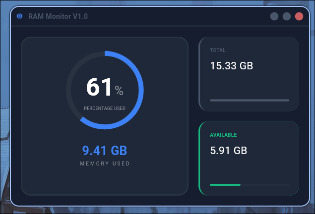

# 💻 RAM Monitor V1.0

<div align="center">


**Real-time RAM monitor with Flutter interface and C++ backend**

[Features](#-features) • [Installation](#-installation) • [Architecture](#-architecture) • [Roadmap](#-roadmap)

</div>

---

## 📸 Preview



Desktop application that monitors system RAM usage in real-time, displaying:

- Usage percentage with circular indicator
- Total system memory
- Available memory
- Memory in use

## ✨ Features

- 🔄 **Real-time updates** - Monitoring every 500ms
- 🎨 **Modern interface** - Dark design :D
- ⚡ **High performance** - Native C++ backend
- 🏗️ **Clean Architecture** - Scalable and maintainable code
- 🔗 **FFI Integration** - Dart ↔ C++ communication via Foreign Function Interface

## 🐧 Supported Platforms

> **⚠️ IMPORTANT:** Currently only supports **Linux**

The application uses `libram_manager.so` (Linux shared object) and reads `/proc/meminfo` to get system information.

**Planned future support:**

- 🪟 Windows (`.dll`)

## 🛠️ Technologies

### Frontend

- **Flutter** - Cross-platform UI framework
- **Provider** - Reactive state management
- **Window Manager** - Native window control

### Backend

- **C++** - Memory reading logic
- **CMake** - Build system
- **FFI (dart:ffi)** - Interoperability with native code

## 📁 Project Structure

```
ram_monitor_project/
├── cpp_library/              # Native C++ library
│   ├── modules/
│   │   └── ram_manager.h     # Header with definitions
│   ├── ram_manager.cpp       # Implementation
│   ├── main.cpp              # Test executable
│   └── CMakeLists.txt        # CMake configuration
│
└── ram_monitor_app/          # Flutter application
    └── lib/
        ├── config/           # Themes and configuration
        ├── domain/           # Entities and contracts
        │   ├── entities/
        │   ├── datasources/
        │   └── repositories/
        ├── data/             # Implementations
        │   ├── models/
        │   ├── datasources/
        │   └── repositories/
        ├── presentation/     # UI
        │   ├── providers/
        │   ├── screens/
        │   └── widgets/
        └── shared/           # Generated FFI bindings
```

## 🚀 Installation

### Prerequisites

- **Flutter SDK** >= 3.0.0
- **CMake** >= 3.10.0
- **GCC/G++** (C++ compiler)
- **Linux** (Ubuntu, Debian, Arch, etc.)

### Step 1: Compile the C++ library

```bash
cd cpp_library
mkdir build && cd build
cmake ..
make
```

This will generate `libram_manager.so` in the `build/` directory.

### Step 2: Copy the library

```bash
# Copy to system directory (requires sudo)
sudo cp libram_manager.so /usr/local/lib/

# Or copy to Flutter app directory
cp libram_manager.so ../ram_monitor_app/linux/
```

### Step 3: Run the Flutter application

```bash
cd ../ram_monitor_app
flutter pub get
flutter run -d linux
```

## 🏗️ Architecture

The project follows **Clean Architecture** with clear separation of concerns:

### Layers

#### 🎯 Domain

- **Entities**: `RamEntity` - Business model
- **Repositories**: Abstract contracts
- **Datasources**: Data source interfaces

#### 💾 Data

- **Models**: `RamModel` - KB → GB conversion
- **Repositories Impl**: Contract implementations
- **Datasources Impl**: `CppDatasource` - FFI calls

#### 🎨 Presentation

- **Providers**: `MainProvider` - State with Provider
- **Screens**: App screens
- **Widgets**: Reusable components

### Data Flow

```mermaid
graph LR
    A[UI Widget] -->|watch| B[MainProvider]
    B -->|getRamInfo| C[RamRepository]
    C -->|getRamInfo| D[CppDatasource]
    D -->|FFI Call| E[libram_manager.so]
    E -->|read| F[/proc/meminfo]
    F -->|RamInfo| E
    E -->|struct| D
    D -->|RamModel| C
    C -->|RamEntity| B
    B -->|notifyListeners| A
```

## 🔧 How It Works

### C++ Side

1. Reads `/proc/meminfo` from Linux system
2. Parses `MemTotal` and `MemAvailable`
3. Calculates `MemUsed = MemTotal - MemAvailable`
4. Returns a `RamInfo` struct with values in KB

### Dart Side

1. Loads `libram_manager.so` with `DynamicLibrary.open()`
2. Calls `get_ram_info()` via FFI
3. Converts KB to GB in `RamModel`
4. Updates UI every 500ms with `Timer.periodic`

## 📦 Main Dependencies

```yaml
dependencies:
  flutter:
    sdk: flutter
  provider: ^6.0.0
  window_manager: ^0.3.0
  ffi: ^2.0.0

dev_dependencies:
  ffigen: ^9.0.0 # Bindings generation
```

## 🎯 Roadmap

### Version 1.0 (Current) ✅

- [x] Basic RAM monitoring
- [x] Modern graphical interface
- [x] C++ integration with FFI
- [x] Linux support

### Version 1.1 (Next)

- [ ] 🧹 **Memory cleanup button**
- [ ] 📊 Historical usage graph
- [ ] ⚙️ Update interval configuration

### Version 2.0 (Future)

- [ ] 🪟 Windows support
- [ ] 📈 CPU monitoring
- [ ] 💾 Disk monitoring
- [ ] 🌐 Network monitoring

## 🧪 Testing

### Test the C++ library standalone

```bash
cd cpp_library/build
./ram_cpp_library
```

Expected output:

```
Hello, from ram_cpp_library!
Total: 15728640
Free: 6045696
Used: 9682944
```

## 🤝 Contributions

This is a personal learning project, but suggestions and feedback are welcome.

## 📝 Technical Notes

### Why C++ for reading memory?

- **Performance**: Direct system reading without overhead
- **Learning**: Practice Flutter-C++ integration
- **Scalability**: Makes it easier to add more system metrics

### Current Limitations

- Linux only (uses `/proc/meminfo`)
- No robust error handling
- Requires manual library compilation

## 📄 License

Educational project - Free use

---

<div align="center">

**Developed with** ❤️ **as a learning project**

_Getting back into C++ after second semester of university_

</div>
